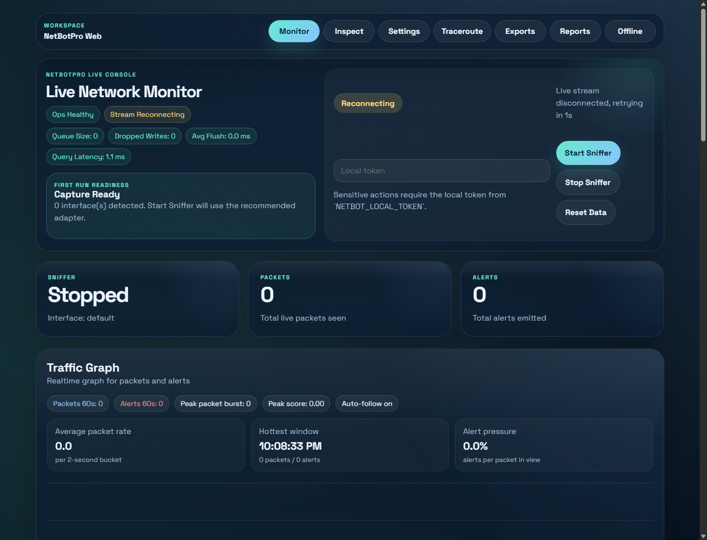
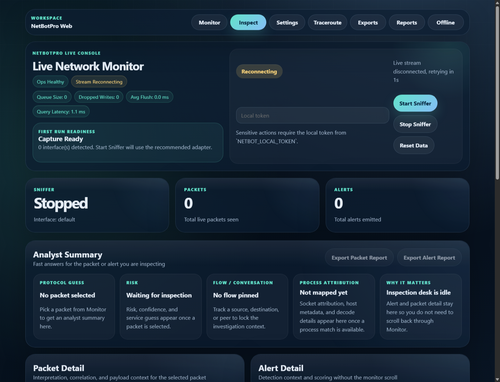
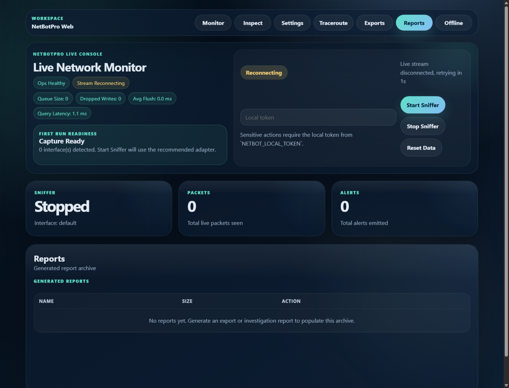
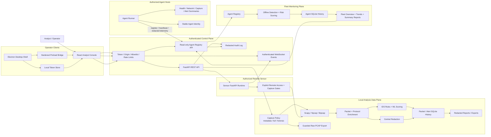

# NetBotPro

[](https://github.com/XploitGost/Netbotpro/actions/workflows/ci.yml)
[](https://github.com/XploitGost/Netbotpro/releases)
[](LICENSE)
[](#legal-and-defensive-use-notice)

NetBotPro is a local-first network analysis and defensive detection product for Windows-first desktop workflows, browser-based investigation, and authorized server-side packet sensing.

It combines a FastAPI backend, a React investigation console, an Electron desktop shell, live packet capture through Scapy/Npcap, offline PCAP analysis, alert scoring, process attribution, exports, reports, and remote sensor mode for systems you own or administer.

## Screenshots

| Monitor | Inspect | Reports |
| --- | --- | --- |
|  |  |  |

## Project Overview

NetBotPro v0.2.0 is a local-first defensive network analysis and fleet
monitoring platform. It combines packet inspection, redacted reporting,
authorized Remote Sensor capture, and summary-only Agent/Fleet monitoring in a
single operator dashboard.

Agent Mode is intentionally read-only. It sends health, network, capture,
alert, flow, and risk summaries without forwarding raw packets, raw payloads,
or PCAP artifacts.

## Key Features

- Live packet and alert monitoring with a responsive analyst console.
- Inspect workspace for packet, alert, flow, process, protocol, and related-activity investigation.
- Local token authentication for sensitive API and websocket routes.
- Websocket auth via subprotocol negotiation to avoid leaking tokens in URLs.
- Offline PCAP analysis with upload size and file-type controls.
- Traceroute, export, report, and investigation packaging flows.
- Desktop mode with a generated secure local token and an isolated Electron preload bridge.
- Remote sensor mode for legally authorized servers and networks.
- Agent Mode for summary-only server telemetry, fleet history, demo data, and
  read-only multi-server dashboards.
- SQLite Agent history, offline detection, risk scoring, redacted Fleet Summary
  Reports, and operational demo/QA scripts.

## Feature Matrix

| Capability | v0.2.0 status | Validation | Security and operational boundary |
| --- | --- | --- | --- |
| Local web dashboard | Ready | React/Vite build and UI tests run on Windows, Linux, and macOS CI. | Sensitive API and websocket access is token-protected when configured. |
| Electron desktop shell | Windows-ready | Windows packaged-backend smoke test runs in CI. | Hardened preload bridge; no Node.js access from the renderer. |
| Live packet capture | Environment-dependent | Core capture and policy paths are covered by backend tests. | Requires Npcap/libpcap, sufficient privileges, and authorized use. |
| Inspect and investigation workspace | Ready | Packet, alert, flow, protocol, process, and context models are tested. | UI-visible text and generated investigation artifacts pass through central redaction. |
| Offline PCAP analysis | Ready | Upload validation and offline-analysis paths are tested. | Restricted file types and upload size limits; analysis remains local. |
| Reports and exports | Ready | JSON, CSV, report, and investigation export paths are tested. | Generated downloads use safe paths; readable content is centrally redacted. |
| Remote Sensor Mode | Controlled opt-in | Capture-mode, sensor-script, and policy tests are included. | Requires explicit remote access, strong token, allowlist controls, and owner/admin permission. |
| Full and Forensic capture | Guarded opt-in | Safe-use, allow-full, duration, and raw-export gates are tested. | Authorized servers only; raw PCAP export is never available in Metadata mode. |
| Agent and Fleet Mode | Ready, read-only | Registry/API/history tests plus Agents UI tests run in CI. | Summary telemetry only; no command/control, file collection, raw packet, payload, or PCAP forwarding. |
| Agent history and risk | Ready | SQLite auto-init, history, offline detection, redaction, and risk scoring are tested. | Redacted history with configurable retention and `90s` default offline threshold. |
| Flow Analysis | Active | Live packets are grouped into directional flows and bidirectional conversations. | Flow snapshots contain redacted metadata, not raw payloads or credentials. |
| Protocol Intelligence | Active MVP | DNS, HTTP, TLS metadata, SSH, RDP, SMB, mail, ICMP, and unknown traffic are classified. | Metadata-safe detection only; no TLS decryption, MITM, or key extraction. |
| TCP Analysis | Active | Handshake state, flags, resets, duplicate ACK, retransmission, and zero-window hints. | Hints are observational, not guaranteed root-cause detection. |
| DNS Intelligence | Active | Query types, response codes, NXDOMAIN rate, repeated-query and entropy hints. | Raw payloads and sensitive-looking values are not displayed. |
| HTTP/TLS Metadata Intelligence | Active | HTTP method/status summaries and visible TLS SNI/ALPN/version summaries. | Authorization, cookies, tokens, and TLS plaintext are not collected or displayed. |
| Protocol Statistics | Active | Packet, flow, byte, alert, expert warning, and risk summaries by protocol. | Summaries operate on the current bounded analysis window. |
| Saved Display Filters | Active | Built-in and custom safe filter expressions with field suggestions. | No Python or JavaScript `eval`; sensitive expressions are redacted. |
| Packet Search | Active | Searches IP, port, protocol, redacted summary, protocol metadata, risk, and Expert fields. | Does not search unredacted raw payloads. |
| Conversation Timeline | Active | Protocol, alert, destination, and lifecycle events are correlated per flow. | Timeline summaries and metadata pass through central redaction. |
| Flow Risk Scoring | Active | Explainable `0..100` scoring covers alerts, volume, DNS failures, unusual protocols/ports, and destinations. | Risk is an investigation aid, not an automated verdict. |
| Offline PCAP Flow Summary | Active | Offline analysis returns flows, conversations, protocol summaries, timelines, and risk distribution. | Existing API response fields remain compatible; output stays redacted. |
| Deep Packet Inspection | Active MVP | Inspect renders a searchable layer tree, safe bytes view, streams, and Expert Info. | No TLS decryption; visible metadata and ASCII previews are centrally redacted. |
| Display Filters | Active MVP | Safe packet and flow filter parser covers text, equality, range, and boolean operators. | Filters run on redacted metadata and never use Python `eval`. |
| Offline PCAP Deep Analysis | Active MVP | Offline results include packet details, Expert Info, and stream summaries. | Previous API fields remain compatible; raw secrets are not exposed. |
| Bounded Packet Intake Queue | Foundation step | Queue pressure metrics, accepted/drop counters, overflow policies, worker liveness, high-water mark, and Ops Snapshot packet queue visibility are tested. | First engine-level performance hardening step; the Worker Pool is not implemented yet. |
| Batch Persistence / Storage Backpressure | Foundation step | Redacted packet, alert, and flow records use a bounded write-behind queue, finite retry, shutdown flush, and Ops metrics. | Audit and report exports remain synchronous; the full performance pipeline is not complete. |
| WebSocket Event Aggregator | Foundation step | Realtime packet/alert batching, slow-client protection, WebSocket pressure metrics, and Ops Snapshot visibility are tested. | Realtime delivery batching only; the Worker Pool is not implemented yet. |
| Batch Persistence | Foundation step | Packet/alert writes and flow snapshot upserts are buffered into bounded batches with retry, latency, backlog, failure, and worker metrics. | Reports remain explicit user-triggered artifacts; this is not a distributed storage engine. |
| Demo and operational QA | Ready | Token-safe demo and Agent script behavior is tested. | Demo launchers and status commands do not print raw tokens. |
| Windows release packaging | Validated path | Desktop smoke, version consistency, and release workflow checks run in CI. | Versioned artifacts include SHA256 checksums. |
| Linux desktop packaging | Staged | Build workflow exists; native production validation remains pending. | Publish only after native smoke and release QA. |
| macOS desktop packaging | Planned | Frontend/backend CI runs on macOS; desktop artifact workflow is not yet provided. | Not advertised as a production desktop release target. |

## Architecture



The architecture deliberately separates two remote paths:

- **Remote Sensor Mode** runs the capture backend on an authorized server and
  remains subject to capture-mode and raw-export policy gates.
- **Agent and Fleet Mode** sends only redacted summary telemetry into a
  read-only registry and history plane. It cannot execute commands or forward
  raw packets, payloads, files, or PCAP artifacts.

## Operational Monitoring

NetBotPro exposes a compact operational snapshot at `/api/monitoring/metrics`
for local health checks and dashboard use. The snapshot reports capture state,
bounded packet intake queue pressure, websocket event delivery, SQLite persistence,
history query latency, flow totals, and detection counters. Recommended actions
in the UI are intentionally short and operational: stale snapshots, capture
stops, queue pressure, dropped writes, websocket delivery gaps, and backend
runtime pressure are surfaced without exposing packet payloads or secrets.

The bounded queue is the first performance-pipeline foundation step, not the
complete performance pipeline. It adds queue pressure metrics, drop counters,
overflow policies, worker liveness, and Ops Snapshot visibility before future
WebSocket batching, batch persistence, and worker-pool work.

The WebSocket Event Aggregator is the next foundation step. It batches realtime
packet and alert updates, coalesces summary updates, protects against slow
clients with a bounded outgoing queue, and exposes WebSocket pressure metrics in
Ops Snapshot. It is still not the complete performance pipeline.

Packet intake queue tuning is controlled by:

- `NETBOT_PACKET_QUEUE_MAX_SIZE`: default `2000`; use `1000` for small/local
  runs and start around `5000` for heavier authorized capture.
- `NETBOT_PACKET_QUEUE_OVERFLOW_POLICY`: default `drop_oldest`; allowed values
  are `drop_oldest` and `drop_newest`.
- `NETBOT_PACKET_QUEUE_DRAIN_TIMEOUT_SEC`: default `5.0`; increase to `10.0`
  when heavier capture should get more shutdown drain time.
- `NETBOT_PERSISTENCE_BATCH_ENABLED`: batching toggle; default `true`. `false`
  uses compatible synchronous writes.
- `NETBOT_PERSISTENCE_PACKET_BATCH_SIZE` / `PACKET_FLUSH_MS`: `500` / `1000`.
- `NETBOT_PERSISTENCE_FLOW_BATCH_SIZE` / `FLOW_FLUSH_MS`: `250` / `1500`.
- `NETBOT_PERSISTENCE_ALERT_BATCH_SIZE` / `ALERT_FLUSH_MS`: `100` / `1000`.
- `NETBOT_PERSISTENCE_AGENT_BATCH_SIZE` / `AGENT_FLUSH_MS`: `100` / `3000`;
  reserved for safe summary-history integration.
- `NETBOT_PERSISTENCE_QUEUE_MAX`: bounded write backlog; default `5000`.
- `NETBOT_PERSISTENCE_RETRY_MAX` / `RETRY_BACKOFF_MS`: `3` / `250`.
- `NETBOT_PERSISTENCE_OVERFLOW_POLICY`: `drop_oldest`, `drop_newest`, or
  `reject_new`; default `drop_oldest`.

`drop_oldest` favors fresher dashboard state during bursts. `drop_newest`
preserves already queued packet order. In both modes, drops are counted, logged,
and surfaced in Ops Snapshot metrics.

## Repository Layout

- `backend/` - FastAPI routes, service layer, websocket event stream, desktop backend entrypoint.
- `core/` - capture providers, packet parsing, IDS logic, scoring, traceroute, firewall helpers, offline analyzer.
- `core/flow_engine.py` and `core/protocol_intelligence.py` - metadata-safe flow, conversation, protocol, timeline, and risk analysis.
- `frontend/` - React/Vite web console.
- `desktop/electron/` - Electron shell, secure preload bridge, packaged desktop runtime.
- `scripts/dev/` - local setup, doctor, start/stop, Npcap install, remote sensor start.
- `scripts/qa/` - smoke, acceptance, security, packaged backend, and release readiness checks.
- `packaging/` - Windows/Linux/macOS packaging scripts and PyInstaller configuration.
- `tests/` - backend, security, capture, persistence, desktop-path, and packaging smoke tests.

## Operational Guides

- [Agent Mode](docs/AGENT_MODE.md)
- [Performance Pipeline](docs/PERFORMANCE_PIPELINE.md)
- [Flow Analysis And Protocol Intelligence](docs/FLOW_ANALYSIS.md)
- [Deep Packet Inspection](docs/DEEP_PACKET_INSPECTION.md)
- [Agent Operational QA Checklist](docs/AGENT_QA_CHECKLIST.md)
- [Deployment Overview](docs/DEPLOYMENT_OVERVIEW.md)
- [Release QA Checklist](docs/RELEASE_QA_CHECKLIST.md)
- [v0.2.0 Release Notes](docs/RELEASE_NOTES_v0.2.0.md)
- [Remote Sensor](docs/REMOTE_SENSOR.md)
- [Capture Modes](docs/CAPTURE_MODES.md)

## Quick Demo

Install dependencies once:

```powershell
python -m pip install -r requirements-dev.txt
cd frontend
npm ci
cd ..
```

Start the backend, seed four realistic demo Agents, and optionally start the
frontend:

```powershell
powershell -ExecutionPolicy Bypass -File .\scripts\dev\start-demo.ps1 -StartFrontend
```

Open:

```text
http://127.0.0.1:5173/?page=agents
```

The demo launcher prints dashboard and log paths, but never prints the raw
local token. The token remains in `.runtime/demo-local-token.txt`.

## Setup

Prerequisites:

- Python 3.13 recommended.
- Node.js 20 recommended.
- Npcap on Windows for live capture.
- Administrator privileges when starting live capture or firewall actions on Windows.

Install everything on Windows:

```powershell
cd "C:\Users\ASIA SYSTEM\Desktop\netbotpro"
powershell -ExecutionPolicy Bypass -File .\scripts\dev\setup.ps1
```

Manual install:

```powershell
python -m venv .venv
.\.venv\Scripts\python.exe -m pip install --upgrade pip
.\.venv\Scripts\python.exe -m pip install -r requirements.txt -r requirements-dev.txt
npm --prefix .\frontend install
npm --prefix .\desktop\electron install
```

## Environment

Copy `.env.example` to `.env` for local experiments. The default secure path is still to let the dev or desktop launcher generate a local token automatically.

- `NETBOT_LOCAL_TOKEN` protects sensitive API routes and websocket sessions.
- `NETBOT_ALLOWED_ORIGINS` controls browser origins allowed to connect to the API/websocket.
- `NETBOT_REMOTE_ACCESS=1` is required before non-loopback clients can access a sensor backend.
- `NETBOT_HOST` and `NETBOT_PORT` control backend bind address and port.
- `NETBOT_AGENT_TOKEN` authorizes summary-only Agent Mode registration and telemetry.

## Usage

Start the local web stack:

```powershell
cd "C:\Users\ASIA SYSTEM\Desktop\netbotpro"
powershell -ExecutionPolicy Bypass -File .\scripts\dev\start-local.ps1
```

Start with elevated privileges for live capture:

```powershell
powershell -ExecutionPolicy Bypass -File .\scripts\dev\start-local.ps1 -Elevated
```

Open the dashboard:

```text
http://127.0.0.1:5173
```

Start the Electron desktop shell after dependencies are installed:

```powershell
cd "C:\Users\ASIA SYSTEM\Desktop\netbotpro\desktop\electron"
npm run dev
```

Start a remote sensor on a server you own or administer:

```powershell
cd "C:\Users\ASIA SYSTEM\Desktop\netbotpro"
powershell -ExecutionPolicy Bypass -File .\scripts\dev\start-sensor.ps1 -BindHost 0.0.0.0 -Port 8765 -AllowedOrigins "http://YOUR_DASHBOARD_HOST:5173"
```

Then connect the dashboard to that sensor:

```text
http://127.0.0.1:5173/?api=http://SERVER_IP:8765/api&ws=ws://SERVER_IP:8765/ws
```

Remote sensor mode is not a public internet service mode. Treat it as a private, controlled sensor endpoint for systems where you have explicit authorization. Prefer VPN, SSH tunneling, private routing, or a TLS reverse proxy, and restrict inbound access to trusted operator IPs.

## Remote Sensor Mode

Remote Sensor Mode runs authorized packet capture on a server while operators
use the dashboard from another trusted machine. Remote access is opt-in,
token-protected, allowlist-capable, and should remain behind a VPN/private
network or secure reverse proxy. Metadata mode is the default; Full and
Forensic capture require explicit authorization and audit.

See [Remote Sensor Mode](docs/REMOTE_SENSOR.md) and
[Capture Modes](docs/CAPTURE_MODES.md).

## Agent And Fleet Mode

Agent Mode is a staged, summary-only server telemetry runner. It registers an
authorized host with the central backend and sends health, network, capture,
alert, and flow summaries without forwarding raw packets, payload previews, or
PCAP artifacts. See [docs/AGENT_MODE.md](docs/AGENT_MODE.md).

The Fleet Dashboard provides online/offline status, health pressure, alerts,
risk scoring, trends, filters, sorting, demo data, history retention, and
redacted JSON/CSV fleet summary reports.

Server Mode adds extra guardrails:

- Safe Use Policy acceptance is required before remote capture starts.
- Remote dashboard clients can be restricted with `NETBOT_REMOTE_IP_ALLOWLIST` or Settings allowlist entries.
- Payload previews are disabled by default; when enabled, Authorization, Cookie, Basic Auth, Bearer token, and sensitive query values are redacted.
- Alert-only mode keeps payload previews empty while still allowing detection metadata.
- Retention settings can automatically remove old packet history and generated reports.
- Capture start/stop, exports, report downloads, and successful remote dashboard authentication are written to `audit.jsonl`.

## Demo Data

Seed or reset demo data without starting the full demo workflow:

```powershell
powershell -ExecutionPolicy Bypass -File .\scripts\dev\seed-agent-demo.ps1 -Reset -Count 4
```

Seeded records include healthy, pressured, critical-alert, and offline Agent
profiles. Demo data contains no raw payload, credential, cookie, authorization
header, or token.

## Deployment Options

- Local demo deployment with `scripts/dev/start-demo.ps1`.
- Local desktop/Electron operation.
- Remote Sensor behind VPN/private routing or a TLS reverse proxy.
- Central Agent/Fleet backend with SQLite history.
- Linux systemd sensor deployment.
- Windows script, Scheduled Task, or reviewed service-wrapper deployment.

See [Deployment Overview](docs/DEPLOYMENT_OVERVIEW.md).

## Testing

```powershell
python -m pip install -r requirements-dev.txt
python -m pip check
python -m unittest discover -s tests -v
npm --prefix .\frontend ci
npm --prefix .\frontend run test:ui
npm --prefix .\frontend run build
npm --prefix .\frontend run smoke
npm --prefix .\frontend run security
powershell -ExecutionPolicy Bypass -File .\scripts\qa\release_readiness.ps1
```

Build Windows desktop artifacts:

```powershell
powershell -ExecutionPolicy Bypass -File .\packaging\windows\build.ps1
```

## Security Model

- Loopback-only by default for local development and desktop mode.
- Remote access is opt-in and requires both `NETBOT_REMOTE_ACCESS=1` and `NETBOT_LOCAL_TOKEN`.
- Optional `NETBOT_REMOTE_IP_ALLOWLIST` limits remote dashboard clients by IP/CIDR.
- Remote sensor mode is documented as an authorized-use-only deployment path, not a general hosted SaaS mode.
- Desktop mode generates a cryptographically secure random token when no token is provided.
- Electron exposes runtime config through a narrow IPC preload bridge with `contextIsolation`, `sandbox`, and `nodeIntegration: false`.
- Sensitive HTTP routes require `X-NetBot-Token`.
- Websocket sessions prefer the `netbot.auth.*` subprotocol instead of query-string tokens.
- Downloads are constrained to generated safe file types inside the NetBotPro log directory.
- Payload previews are off by default and sensitive HTTP/token fields are redacted when previews are enabled.
- Agent tokens are hashed for registry storage and excluded from script/log
  output.
- Agent Mode has no command/control, remote shell, file collection, raw packet
  forwarding, raw payload forwarding, or PCAP forwarding.

## Limitations

- Live capture depends on OS permissions, Npcap/libpcap availability, and visible capture interfaces.
- Process attribution can be incomplete for short-lived sockets, kernel-owned traffic, NAT, or traffic observed away from the endpoint.
- Remote sensor mode analyzes traffic visible to that server/interface; it does not magically see traffic from unrelated network segments.
- Windows artifacts are currently unsigned unless a signing certificate is configured.
- Linux/macOS packaging paths exist, but production-grade desktop release validation is strongest on Windows right now.

## Troubleshooting

| Symptom | Likely cause | Fix |
| --- | --- | --- |
| `Start Sniffer` says no capture interface is available | Npcap/libpcap is missing, blocked, or not visible to Scapy | Install Npcap, reopen PowerShell as Administrator, then run `scripts\dev\doctor.ps1`. |
| Frontend shows `ECONNREFUSED 127.0.0.1:8765` | Backend is not running or crashed | Run `scripts\dev\start-local.ps1`, then inspect `.runtime\backend-dev.err.log`. |
| Protected API returns `401` | Missing or wrong local token | Use `.runtime\local-token.txt`, `.runtime\demo-local-token.txt`, or your configured `NETBOT_LOCAL_TOKEN`. |
| Websocket returns `403` | Token/origin mismatch | Confirm `NETBOT_ALLOWED_ORIGINS` includes the dashboard origin and the frontend sends the local token. |
| Electron launches but backend fails | Packaged runtime or Python dev runtime is missing | Run `scripts\qa\release_readiness.ps1`, then rebuild with `packaging\windows\build.ps1`. |
| Remote dashboard cannot connect to sensor | Firewall, origin, token, or bind address mismatch | Use `start-sensor.ps1`, set `AllowedOrigins`, keep `NETBOT_REMOTE_ACCESS=1`, and test over VPN/private network first. |

## Roadmap

- Complete the performance foundation with a flow-aware worker pool, live ring
  buffer, and benchmark/soak validation.
- Add conservative Service Attribution / Destination Intelligence using DNS,
  TLS SNI, HTTP Host, QUIC-visible metadata, ASN, and local fingerprints. Low
  confidence remains `Unknown`; no TLS decryption or credential collection.
- Build a read-only Incident / Correlation Engine after attribution quality is
  validated, then consider a strictly read-only AI Analyst.
- Versioned SQLite schema migrations and longer-lived deployment operations.
- Per-Agent enrollment, rotation, and revocation workflows.
- Signed desktop artifacts when release signing infrastructure is available.
- Additional Linux/macOS release validation.

Command/control, remote shell, file collection, raw packet forwarding, raw
payload forwarding, PCAP forwarding, and Agent auto-update are not part of
v0.2.0.

## Safe And Authorized Use Notice

NetBotPro is intended for defensive monitoring, troubleshooting, education, and authorized security analysis. Only capture, inspect, or analyze traffic on systems, accounts, servers, and networks where you have explicit legal permission. Do not use this project for unauthorized surveillance, intrusion, credential theft, evasion, or abuse.

## Release

Current release target: `v0.2.0`.

GitHub Actions builds CI on push and pull request. Desktop release artifacts are produced by the `Release Desktop` workflow. Pushing a version tag such as `v0.2.0` triggers the release workflow, generates SHA256 checksums, and publishes versioned artifacts with release notes from `CHANGELOG.md`.

## Documentation Links

- [Architecture](docs/ARCHITECTURE.md)
- [Security policy](SECURITY.md)
- [Threat model](docs/THREAT_MODEL.md)
- [Safe use policy](docs/SAFE_USE_POLICY.md)
- [Capture modes](docs/CAPTURE_MODES.md)
- [Server deployment](docs/SERVER_DEPLOYMENT.md)
- [Remote sensor mode](docs/REMOTE_SENSOR.md)
- [Agent mode](docs/AGENT_MODE.md)
- [Agent QA checklist](docs/AGENT_QA_CHECKLIST.md)
- [Deployment overview](docs/DEPLOYMENT_OVERVIEW.md)
- [Release QA checklist](docs/RELEASE_QA_CHECKLIST.md)
- [Desktop shell](docs/DESKTOP_SHELL.md)
- [Web migration notes](docs/WEB_MIGRATION.md)
- [Contributing](CONTRIBUTING.md)
