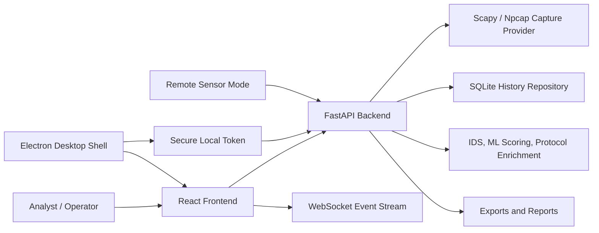

# NetBotPro

NetBotPro is a local-first network analysis and defensive detection product for Windows-first desktop workflows, browser-based investigation, and authorized server-side packet sensing.

It combines a FastAPI backend, a React investigation console, an Electron desktop shell, live packet capture through Scapy/Npcap, offline PCAP analysis, alert scoring, process attribution, exports, reports, and remote sensor mode for systems you own or administer.


## What It Does

- Live packet and alert monitoring with a responsive analyst console.
- Inspect workspace for packet, alert, flow, process, protocol, and related-activity investigation.
- Local token authentication for sensitive API and websocket routes.
- Websocket auth via subprotocol negotiation to avoid leaking tokens in URLs.
- Offline PCAP analysis with upload size and file-type controls.
- Traceroute, export, report, and investigation packaging flows.
- Desktop mode with a generated secure local token and an isolated Electron preload bridge.
- Remote sensor mode for legally authorized servers and networks.

## Architecture



## Repository Layout

- `backend/` - FastAPI routes, service layer, websocket event stream, desktop backend entrypoint.
- `core/` - capture providers, packet parsing, IDS logic, scoring, traceroute, firewall helpers, offline analyzer.
- `frontend/` - React/Vite web console.
- `desktop/electron/` - Electron shell, secure preload bridge, packaged desktop runtime.
- `scripts/dev/` - local setup, doctor, start/stop, Npcap install, remote sensor start.
- `scripts/qa/` - smoke, acceptance, security, packaged backend, and release readiness checks.
- `packaging/` - Windows/Linux/macOS packaging scripts and PyInstaller configuration.
- `tests/` - backend, security, capture, persistence, desktop-path, and packaging smoke tests.

## Setup

Prerequisites:

- Python 3.13 recommended.
- Node.js 20 recommended.
- Npcap on Windows for live capture.
- Administrator privileges when starting live capture or firewall actions on Windows.

Install everything on Windows:

```powershell
cd "C:\Users\ASIA SYSTEM\Desktop\netbotpro"
powershell -ExecutionPolicy Bypass -File .\scripts\dev\setup.ps1
```

Manual install:

```powershell
python -m venv .venv
.\.venv\Scripts\python.exe -m pip install --upgrade pip
.\.venv\Scripts\python.exe -m pip install -r requirements.txt -r requirements-dev.txt
npm --prefix .\frontend install
npm --prefix .\desktop\electron install
```

## Environment

Copy `.env.example` to `.env` for local experiments. The default secure path is still to let the dev or desktop launcher generate a local token automatically.

- `NETBOT_LOCAL_TOKEN` protects sensitive API routes and websocket sessions.
- `NETBOT_ALLOWED_ORIGINS` controls browser origins allowed to connect to the API/websocket.
- `NETBOT_REMOTE_ACCESS=1` is required before non-loopback clients can access a sensor backend.
- `NETBOT_HOST` and `NETBOT_PORT` control backend bind address and port.

## Usage

Start the local web stack:

```powershell
cd "C:\Users\ASIA SYSTEM\Desktop\netbotpro"
powershell -ExecutionPolicy Bypass -File .\scripts\dev\start-local.ps1
```

Start with elevated privileges for live capture:

```powershell
powershell -ExecutionPolicy Bypass -File .\scripts\dev\start-local.ps1 -Elevated
```

Open the dashboard:

```text
http://127.0.0.1:5173
```

Start the Electron desktop shell after dependencies are installed:

```powershell
cd "C:\Users\ASIA SYSTEM\Desktop\netbotpro\desktop\electron"
npm run dev
```

Start a remote sensor on a server you own or administer:

```powershell
cd "C:\Users\ASIA SYSTEM\Desktop\netbotpro"
powershell -ExecutionPolicy Bypass -File .\scripts\dev\start-sensor.ps1 -BindHost 0.0.0.0 -Port 8765 -AllowedOrigins "http://YOUR_DASHBOARD_HOST:5173"
```

Then connect the dashboard to that sensor:

```text
http://127.0.0.1:5173/?api=http://SERVER_IP:8765/api&ws=ws://SERVER_IP:8765/ws
```

## Verification

```powershell
.\.venv\Scripts\python.exe -m unittest discover -s tests -v
npm --prefix .\frontend run build
npm --prefix .\frontend run smoke
npm --prefix .\frontend run security
powershell -ExecutionPolicy Bypass -File .\scripts\qa\release_readiness.ps1
```

Build Windows desktop artifacts:

```powershell
powershell -ExecutionPolicy Bypass -File .\packaging\windows\build.ps1
```

## Security Model

- Loopback-only by default for local development and desktop mode.
- Remote access is opt-in and requires both `NETBOT_REMOTE_ACCESS=1` and `NETBOT_LOCAL_TOKEN`.
- Desktop mode generates a cryptographically secure random token when no token is provided.
- Electron exposes runtime config through a narrow IPC preload bridge with `contextIsolation`, `sandbox`, and `nodeIntegration: false`.
- Sensitive HTTP routes require `X-NetBot-Token`.
- Websocket sessions prefer the `netbot.auth.*` subprotocol instead of query-string tokens.
- Downloads are constrained to generated safe file types inside the NetBotPro log directory.

## Limitations

- Live capture depends on OS permissions, Npcap/libpcap availability, and visible capture interfaces.
- Process attribution can be incomplete for short-lived sockets, kernel-owned traffic, NAT, or traffic observed away from the endpoint.
- Remote sensor mode analyzes traffic visible to that server/interface; it does not magically see traffic from unrelated network segments.
- Windows artifacts are currently unsigned unless a signing certificate is configured.
- Linux/macOS packaging paths exist, but production-grade desktop release validation is strongest on Windows right now.

## Legal And Defensive Use Notice

NetBotPro is intended for defensive monitoring, troubleshooting, education, and authorized security analysis. Only capture, inspect, or analyze traffic on systems, accounts, servers, and networks where you have explicit legal permission. Do not use this project for unauthorized surveillance, intrusion, credential theft, evasion, or abuse.

## Release

GitHub Actions builds CI on push and pull request. Desktop release artifacts are produced by the `Release Desktop` workflow. Pushing a version tag such as `v0.1.3` triggers the release workflow and publishes the generated artifacts to GitHub Releases.

## More Docs

- [Architecture](docs/ARCHITECTURE.md)
- [Remote sensor mode](docs/REMOTE_SENSOR.md)
- [Desktop shell](docs/DESKTOP_SHELL.md)
- [Web migration notes](docs/WEB_MIGRATION.md)
- [Contributing](CONTRIBUTING.md)
