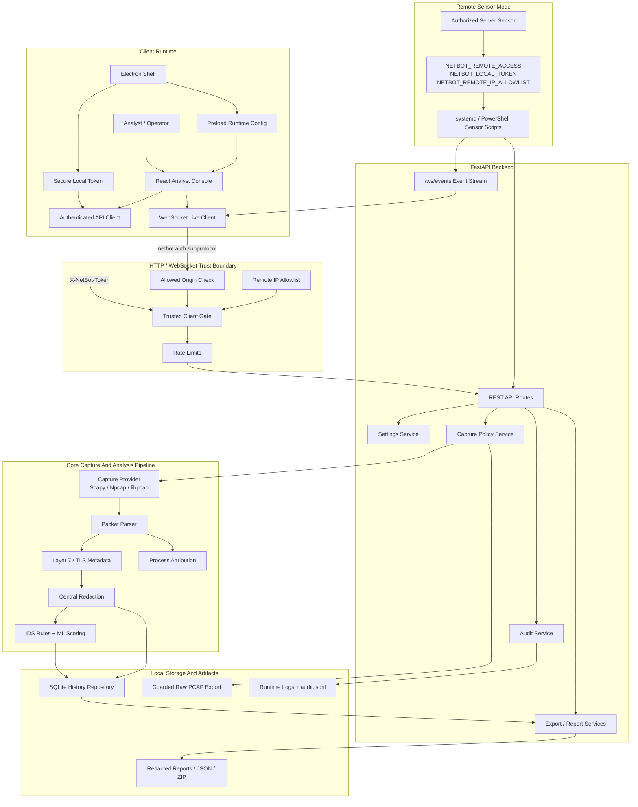

# Architecture

NetBotPro is a local-first defensive network analysis product. The project is intentionally split into a small set of runtime layers so desktop packaging, browser development, backend testing, and remote sensor operation can evolve without mixing responsibilities.

## Product Shape

- `backend/`: FastAPI API, session control, event transport, history, exports, reports, and security middleware.
- `frontend/`: React/Vite analyst dashboard for Monitor, Inspect, Settings, Traceroute, Exports, Reports, and Offline Analysis.
- `desktop/electron/`: local desktop shell that starts the backend, injects runtime configuration, and hosts the built frontend.
- `core/`: packet capture, parsing, protocol enrichment, IDS heuristics, scoring, traceroute helpers, firewall helpers, process mapping, and offline analysis.
- `config/`: persisted runtime settings.
- `packaging/`: PyInstaller and Electron packaging scripts.
- `scripts/`: dev setup, local runtime, QA smoke checks, and release staging.

## Runtime Flow

1. The backend owns capture, enrichment, detection, persistence, and control actions.
2. The frontend reads state from `/api/*` and live events from `/ws/events`.
3. Electron starts a local backend process, generates or forwards a local token, and exposes runtime config through the preload bridge.
4. Remote sensor mode runs the same backend on an owned server, but only when explicitly enabled and token-protected.

## Control Plane

The control plane is intentionally narrow. All browser and desktop clients talk
to FastAPI through authenticated REST routes and the authenticated websocket
event stream. Sensitive actions require `X-NetBot-Token`; websocket sessions
prefer the `netbot.auth.*` subprotocol so tokens do not have to travel in URLs.

Remote sensor deployments add another gate before the backend routes are useful:
`NETBOT_REMOTE_ACCESS=1`, a configured local token, optional IP/CIDR allowlists,
allowed origins, and rate limits. Loopback development remains convenient, while
remote dashboard access is explicit and auditable.

## Data Plane

The data plane stays local to the machine running the backend. Packets flow from
the capture provider into parsing, layer-7 metadata extraction, redaction,
detection, process attribution, history persistence, and report/export services.
Metadata mode avoids storing payload previews. Full and Forensic modes are
guarded by the capture policy service and are only intended for authorized
servers with owner or administrator approval.

Raw PCAP artifacts are not treated like normal reports. They are exposed only
through the guarded raw export path, require Full or Forensic mode, require Safe
Use acceptance, require token authorization, and create audit records.

## Security-Critical Services

- `backend/app/security.py`: client trust, local token checks, websocket token
  extraction, origin checks, remote allowlists, rate limits, and safe path
  validation.
- `backend/app/services/capture_policy.py`: metadata/full/forensic mode gates,
  Safe Use enforcement, full-capture opt-in, and forensic duration/confirmation.
- `backend/app/services/audit_service.py`: append-only JSONL audit events with
  credential redaction.
- `backend/app/services/redaction.py` and `core/redaction.py`: shared masking for
  UI-visible payload previews, reports, exports, and audit text.

## Backend Layer

The FastAPI app in `backend/app/main.py` is the product boundary for UI clients. It exposes status, settings, capture control, packet history, alert history, exports, reports, traceroute, and offline PCAP analysis.

Important service modules:

- `backend/app/services/sniffer_service.py`: capture lifecycle and runtime state.
- `backend/app/services/history_service.py`: history reads and detail/context retrieval.
- `backend/app/services/event_bus.py`: versioned live event fan-out.
- `backend/app/services/report_service.py`: report enumeration and safe download metadata.
- `backend/app/security.py`: local token, remote access, origin checks, validation, rate limiting, and safe path handling.

## Core Layer

The `core/` package keeps network-domain behavior away from HTTP concerns.

- `core/capture/`: capture provider abstraction and system capture integration.
- `core/netbotpro_sniffer_core/`: packet parsing, TLS/layer-7 helpers, interface handling, and runtime utilities.
- `core/ids_*` and `core/score_engine.py`: alert rules and risk scoring.
- `core/process_mapping.py`: process attribution for local traffic.
- `core/offline_analyzer.py`: PCAP analysis path.

## Frontend Layer

The frontend is intentionally API-driven. It does not perform packet capture itself.

- `frontend/src/hooks/useDashboardController.js`: top-level state machine for dashboard data, live events, filters, and navigation.
- `frontend/src/hooks/useApiClient.js`: authenticated API client.
- `frontend/src/hooks/useLiveEvents.js`: websocket transport.
- `frontend/src/components/`: visual workspaces and reusable panels.
- `frontend/src/lib/`: runtime config, network classification, inspection models, and operational health helpers.

## Desktop Layer

The Electron shell keeps a narrow trust boundary:

- `main.cjs` owns backend process launch, local token creation, window hardening, and IPC registration.
- `preload.cjs` exposes only frozen runtime config to the frontend.
- `contextIsolation`, `sandbox`, `nodeIntegration: false`, and navigation restrictions are enabled.

## Trust Boundaries

- Browser UI to backend API: protected by local token on sensitive routes.
- Browser UI to websocket: protected by token subprotocol and allowed origin checks.
- Desktop shell to frontend: narrow preload bridge only.
- Remote client to sensor backend: disabled unless `NETBOT_REMOTE_ACCESS=1` and `NETBOT_LOCAL_TOKEN` are set.
- Generated files to download API: constrained to safe suffixes and log/export directories.

## Persistence And Data

Runtime data is local-first. Desktop mode maps config, data, and logs into the Electron user-data directory. Dev mode uses project-local runtime paths where configured. Exports and reports are generated under the log directory and exposed only through safe relative filenames.

## Release Posture

Windows is the validated desktop release target for `0.2.0`. Linux and macOS packaging scripts exist, but production validation remains staged until those artifacts are built and smoke-tested on native hosts.
